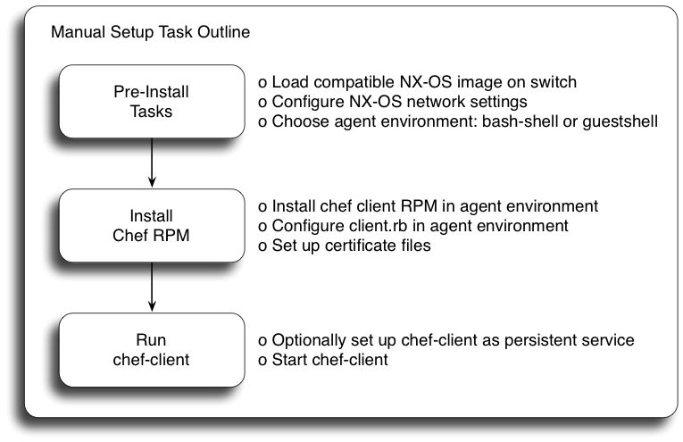

# chef-client Installation & Setup: Cisco Nexus

#### Table of Contents

1. [Overview](#overview)
1. [Pre-Install Tasks](#pre-install-tasks)
1. [chef-client Environment: bash-shell](#env-bs)
1. [chef-client Environment: guestshell](#env-gs)
1. [chef-client Environment: open agent container (OAC)](#env-oac)
1. [chef-client Installation, Configuration and Usage](#agent-config)
1. [(optional) guestshell & High Availability (HA) Platforms](#ha)
1. [(optional) chef-client Persistence](#persistence)
1. [(optional) Automated Installation Options](#auto-install)
1. [References](#references)

## Overview

This document describes chef-client installation and setup on Cisco Nexus switches. These instructions focus on manual setup. See [Automated Installation](#auto-install) section for documentation regarding alternative installation methods.



## Pre-Install Tasks

#### Platform and Software Requirements
See [Requirements](../README.md#requirements) for details on platform and software requirements.

Please note: A virtual Nexus N9k/N3k may be helpful for development and testing. Users with a valid [cisco.com](http://cisco.com) user ID can obtain a copy of a virtual Nexus N9k/N3k by sending their [cisco.com](http://cisco.com) user ID in an email to <get-n9kv@cisco.com>. If you do not have a [cisco.com](http://cisco.com) user ID please register for one at [https://tools.cisco.com/IDREG/guestRegistration](https://tools.cisco.com/IDREG/guestRegistration)

#### Disk space

400MB of free disk space on bootflash is recommended before installing the
chef-client software.

#### Environment
NX-OS supports three possible environments for running third party software:
`bash-shell`, `guestshell` and the `open agent container (OAC)`.

**NOTE:** Starting in release `9.2(1)` and later, installing the chef-client into the `bash-shell` hosting environment is no longer supported.  Instead the chef-client software should be installed into the [`guestshell` hosting environment](#env-gs).


|Environment                  | Supported Platforms       |
|-----------------------------|---------------------------|
|`bash-shell` or `guestshell` | Cisco Nexus N3k, N9k, N9k-F |
|`open agent container (OAC)` | Cisco Nexus N5k, N6k, N7k |

You may run chef-client from either `bash-shell` or `guestshell` on supported platforms but not from both at the same time.

* `bash-shell`
   * This is the native WRL linux environment underlying NX-OS. It is disabled by default.
* `guestshell`
   * This is a secure linux container environment running CentOS. It is enabled by default in most platforms.
* `open agent container`
   * This is a 32-bit CentOS-based container created specifically for running chef-client software.
   * OAC containers are created for specific platforms and must be downloaded from Cisco.
   * The OAC must be installed before the Chef client can be installed.

#### Network Setup

Ensure that network connectivity exists prior to chef-client install. Some basic NX-OS cli configuration may be necessary.

**Example:** Connectivity via Management interface. _Note: The management interface exists in a separate VRF context and requires additional configuration as shown._

```
config term
  ntp server 10.0.0.201 use-vrf management

  vrf context management
    ip name-server 10.0.0.202
    ip domain-name mycompany.com
    ip route 0.0.0.0/0 10.0.0.1

  interface mgmt0
    vrf member management
    ip address 10.0.0.99/24
end
```

## <a name="env-bs">chef-client Environment: bash-shell</a>

**NOTE:** Starting in release `9.2(1)` and later, installing the chef-client into the `bash-shell` hosting environment is no longer supported.  Instead the chef-client software should be installed into the [`guestshell` hosting environment](#env-gs).


This section is only necessary if chef-client will run from the `bash-shell`.

#### NX-OS Setup

The `bash-shell` is disabled by default. Enable it with the feature configuration command.

```
config term
  feature bash-shell
end
```

#### chef-client environment setup in bash-shell

Enter the `bash-shell` environment and become root

```bash
n3k# run bash
bash-4.2$
bash-4.2$  sudo su -
```
If using the management interface you must next switch to the management namespace

```bash
ip netns exec management bash
```
Set up DNS configuration

```bash
cat >> /etc/resolv.conf << EOF
nameserver 10.0.0.202
domain mycompany.com
search mycompany.com
EOF
```

*Please note: The current NX-OS bash-shell implementation does not automatically persist the entire linux filesystem. This means that certain files such as `/etc/resolv.conf` will not automatically be persistent after system reloads. Please execute `copy running-config startup-config` from the NX-OS cli after any changes to /etc/resolv.conf to ensure that it is persistent. This command can also be executed directly from the bash-shell using the vsh tool as shown:*

```
vsh -c 'copy running-config startup-config'
```

## <a name="env-gs">chef-client Environment: guestshell</a>

This section is only necessary if chef-client will run from the `guestshell`.

#### NX-OS Setup

The `guestshell` container environment is enabled by default on most platforms; however, the default disk and memory resources allocated to the guestshell container may be too small to support chef-client requirements. These resource limits may be increased with the NX-OS CLI `guestshell resize` commands as shown below.

The recommended minimum values are currently:
```bash
  Disk   : 500MB
  Memory : 500MB
```

Use the `show guestshell detail` command to display the current state of the guestshell:

```
n3k# show guestshell detail
Virtual service guestshell+ detail
  State                 : Activated
 ...
    Resource reservation
    Disk                : 150 MB
    Memory              : 128 MB

```

Use the `guestshell resize rootfs` command to resize the guestshell filesystem. Use the `guestshell resize memory` command to resize the guestshell memory allocation. These commands may be executed even when the guestshell is not yet enabled. Note that the resize command does not take effect until after the guestshell container is (re)started with the `guestshell reboot` or `guestshell enable` command.

**Example.** Guestshell is currently enabled. Resize guestshell filesystem to 500MB and memory to 500MB

```
n3k# guestshell resize rootfs ?
  <158-600>  New root filesystem size (in MB)

n3k# guestshell resize rootfs 500
Note: Please disable/enable or reboot the Guest shell for root filesystem to be resized

n3k# guestshell resize memory 500
Note: Please disable/enable or reboot the Guest shell for system memory to be resized

n3k# guestshell reboot
Access to the guest shell will be temporarily disabled while it reboots.
Are you sure you want to reboot the guest shell? (y/n) [n] y
```

**Example.** Guestshell is currently disabled. Resize guestshell filesystem to 500MB and memory to 500MB

```
n3k# guestshell resize rootfs 500
Note: Root filesystem will be resized on Guest shell enable

n3k# guestshell resize memory 500
Note: System memory will be resized on Guest shell enable

n3k# guestshell enable
```

See [References](#references) for more guestshell documentation.

#### guestshell network setup

The `guestshell` is an independent CentOS container which doesn't inherit settings from NX-OS; thus it requires additional network configuration.

```bash

# Enter the guestshell environment using the 'guestshell' command
guestshell

# If using the management interface you must enter the management namespace
sudo su -
chvrf management

# Set up hostname and DNS configuration
hostname n3k

echo 'n3k' > /etc/hostname

cat >> /etc/resolv.conf << EOF
nameserver 10.0.0.202
domain mycompany.com
search mycompany.com
EOF

```

## <a name="env-oac">chef-client Environment: open agent container (OAC)</a>

This section is only necessary if chef-client will run from the `open agent container`.

#### Set Up NX-OS

Download the `OAC` `oac.1.0.0.ova` file.

| Platform | OAC Download Link |
|----------|-------------------|
| Nexus 7xxx | [Download Link](https://software.cisco.com/download/release.html?i=!y&mdfid=283748960&softwareid=282088129&release=7.3%280%29D1%281%29&os=)|
| Nexus 56xx and 60xx | [Download Link](https://software.cisco.com/download/release.html?i=!y&mdfid=284360574&softwareid=282088130&release=7.3%280%29N1%281%29&os=)|

Copy the `ova` file to the `bootflash:` device.

~~~
n7k# dir bootflash: | inc oac.1.0.0.ova
   45424640    Feb 12 19:37:40 2016  oac.1.0.0.ova
~~~

Use the `show virtual-service global` command to display available resources for the `OAC` Virtual Service.

~~~
n7k# show virtual-service global 
...
Resource virtualization limits:
Name                        Quota    Committed    Available
-----------------------------------------------------------------------
system CPU (%)                  6            0            6
memory (MB)                  2304            0         2304
bootflash (MB)                600            0          600

n7k# 
~~~

The recommended minimum values are currently:

~~~bash
  memory    : 256MB
  bootflash : 400MB
~~~

**NOTE:** If insufficent `bootflash:` resources are available, remove unneeded files from `bootflash:` to free up space.

Install the `OAC` Virtual Service using the `virtual-service install` command:
`virtual-service install name oac package bootflash:oac.1.0.0.ova`

~~~
n7k# virtual-service install name oac package bootflash:oac.1.0.0.ova
Note: Installing package 'bootflash:/oac.1.0.0.ova' for virtual service 'oac'. Once the install has finished, the VM may be activated. Use 'show virtual-service list' for progress.

n7k# 2016 Feb 12 19:51:14 n7k %$ VDC-1 %$ %VMAN-2-INSTALL_STATE: Successfully installed virtual service 'oac'

n7k# show virtual-service list

Virtual Service List:

Name                    Status             Package Name
-----------------------------------------------------------------------
oac                     Installed          oac.1.0.0.ova

n7k# 
~~~

Activate the OAC using the `virtual-service` configuration command:

~~~
n7k# config t
Enter configuration commands, one per line.  End with CNTL/Z.
n7k(config)# virtual-service oac
n7k(config-virt-serv)# activate
Note: Activating virtual-service 'oac', this might take a few minutes. Use 'show virtual-service list' for progress.
n7k(config-virt-serv)# 
n7k(config-virt-serv)# end
n7k# 
n7k# 2016 Feb 12 19:55:06 n7k %$ VDC-1 %$ %VMAN-2-ACTIVATION_STATE: Successfully activated virtual service 'oac'
~~~

You may verify activation by using the `show virtual-service list` command:

~~~
n7k# show virtual-service list

Virtual Service List:

Name                    Status             Package Name
-----------------------------------------------------------------------
oac                     Activated          oac.1.0.0.ova

n7k# 
~~~

Open a console session to the `OAC` using the `virtual-service connect` command:

`virtual-service connect name oac console`

*note: The OAC's root password is initially set to `oac`. You are required to change it on initial login.*

~~~
n7k# virtual-service connect name oac console
Connecting to virtual-service.  Exit using ^c^c^c
Trying 127.1.1.5...
Connected to 127.1.1.5.
Escape character is '^]'.


CentOS release 6.7 (Final)
Kernel 2.6.99.99 on an x86_64

localhost login: root
Password: 
You are required to change your password immediately (root enforced)
Changing password for root.
(current) UNIX password: 
New password: 
Retype new password: 
[root@localhost ~]# 
~~~

See [References](#references) for more OAC documentation.

#### Set Up OAC Network

The `open agent container` is an independent CentOS container that doesn't inherit settings from NX-OS; thus it requires additional network configuration.  This configuration will be applied inside the `OAC` container.

Connect to the OAC console, then:

~~~bash

# First become root:
sudo su -

# Enter the management namespace if your device uses the management interface for connectivity.
chvrf management

# Set up hostname and DNS configuration
hostname n7k

echo 'n7k' > /etc/hostname

cat >> /etc/resolv.conf << EOF
nameserver 10.0.0.202
domain mycompany.com
search mycompany.com
EOF
~~~

## <a name="agent-config">chef-client Installation, Configuration and Usage</a>

This section is common to `bash-shell`, `guestshell` and the `open agent container`.

#### Install Chef-Client

If needed, configure a proxy server to gain network access to `chef.io`:

~~~bash
export http_proxy="http://proxy.yourdomain.com:<port>"
export https_proxy="https://proxy.yourdomain.com:<port>"
~~~

##### Run Chef Install Script <sup>1</sup>

```bash
curl 'https://www.chef.io/chef/install.sh' | bash -s -- -v 12.7.2
```

<sup>1</sup> *Note: At the time of release 1.1.0 it appears that the `bash-shell` environment may encounter a certificate error on some platforms during chef-client install. The workaround for this problem is to use `wget` and manually install the chef-client rpm as shown:*

```bash
wget https://packages.chef.io/stable/nexus/7/chef-12.10.24-1.nexus7.x86_64.rpm --no-check-certificate

yum localinstall chef-12.10.24-1.nexus7.x86_64.rpm
```

#### validation.pem

You must copy the validation.pem file from the chef-server to `/etc/chef/validation.pem`

#### client.rb

Edit the chef client config file:  `/etc/chef/client.rb` with settings similar to the following:

```bash

  validation_client_name 'chef-validator'

  chef_server_url 'https://my_chef_server.mycompany.com/organizations/chef'

  node_name 'n3k.mycompany.com'   # "This" client device.

  cookbook_sync_threads   5       # necessary for small memory switches (4G or less)

  interval 30                     # client-run interval; remove for "never"

```

See the following references for more client.rb settings:

<https://docs.chef.io/config_rb_client.html>

#### server certificate

With some chef versions it may be necessary to also fetch the server certificate from the client device:

```bash

knife ssl fetch -c /etc/chef/client.rb

```

#### Run the chef-client

```bash

chef-client

```


## <a name="ha">guestshell & High Availability (HA) Platforms</a>

(Optional) This section discusses `guestshell` usage on HA platforms. This section does not apply to the bash-shell environment or to single-sup platforms.

The `guestshell` container does not automatically sync filesystem changes from the active processor to the standby processor. This means that chef-client installation files and related file changes performed in the earlier steps will not be present on the standby until they are manually synced with the following NX-OS exec command:

```

guestshell sync

```

## <a name="persistence">chef-client Persistence</a>

(Optional) This section discusses chef-client persistence after system restarts.

1. [Service Management in bash-shell using init.d](#svc-mgmt-bs)
2. [Service Management in guestshell using systemd](#svc-mgmt-gs)

#### Service Management

It may be desirable to set up automatic restart of the chef-client in the event of a system reset. The bash and guestshell environments use different methods to achieve this.

#### <a name="svc-mgmt-bs">(optional) bash-shell / init.d</a>

The `bash-shell` environment uses **init.d** for service management.

**Example:** Create an initd script file as `/etc/init.d/chef-client`

```bash
#!/bin/bash
#
# chef-client Startup script for the Chef client
#
# description: Client component of the Chef systems integration framework.
### BEGIN INIT INFO
# Provides: chef-client
# Required-Start: $local_fs $network $remote_fs
# Required-Stop: $local_fs $network $remote_fs
# Should-Start: $named $time
# Should-Stop: $named $time
# Short-Description: Startup script for the Chef client
# Description: Client component of the Chef systems integration framework.
### END INIT INFO
# Source function library
. /etc/init.d/functions
exec="/usr/bin/chef-client"
prog="chef-client"
[ -e /etc/sysconfig/$prog ] && . /etc/sysconfig/$prog
config=${CONFIG-/etc/chef/client.rb}
pidfile=${PIDFILE-/var/run/chef/client.pid}
lockfile=${LOCKFILE-/var/lock/subsys/$prog}
interval=${INTERVAL-30}
splay=${SPLAY-20}
options=${OPTIONS-}
start() {
    [ -x $exec ] || exit 5
    [ -f $config ] || exit 6
echo -n $"Starting $prog: "
    daemon sudo ip netns exec management $exec -d -c "$config" -P "$pidfile" -i "$interval" -s "$splay" "$options"
    retval=$?
echo
    [ $retval -eq 0 ] && touch $lockfile
return $retval
}
stop() {
echo -n $"Stopping $prog: "
    killproc -p $pidfile $exec
    retval=$?
echo
    [ $retval -eq 0 ] && rm -f $lockfile
return $retval
}
restart () {
    stop
    start
}
reload() {
echo -n $"Reloading $prog: "
    killproc -p $pidfile $exec -HUP
    retval=$?
echo
return $retval
}
force_reload() {
    restart
}
rh_status() {
# run checks to determine if the service is running or use generic status
    status -p $pidfile $prog
}
rh_status_q() {
    rh_status >/dev/null 2>&1
}
case "$1" in
    start)
        rh_status_q && exit 0
$1
        ;;
    stop)
        rh_status_q || exit 0
$1
        ;;
    restart)
$1
        ;;
    reload)
        rh_status_q || exit 7
$1
        ;;
    force-reload)
        force_reload
        ;;
    status)
        rh_status
        ;;
    condrestart|try-restart)
        rh_status_q || exit 0
        restart
        ;;
*)
echo $"Usage: $0 {start|stop|status|restart|condrestart|try-restart|reload|force-reload}"
exit 2
esac
exit $?

```

Next, add your service to initd management and optionally start it:

```bash

chkconfig --add chef-client
chkconfig --level 345 chef-client on

service chef-client start
```

#### <a name="svc-mgmt-gs">(optional) guestshell / systemd</a>

The `guestshell` environment uses **systemd** for service management.

**Example:** Cut&paste the following to create a service file in `/usr/lib/systemd/system/`

```bash
cat >> /usr/lib/systemd/system/my_chef.service << EOF

[Unit]
Description=my chef-client daemon
After=syslog.target network.target auditd.service

[Service]
Environment=
ExecStartPre=
# Note for below:
# The command prefix '/bin/nsenter --net=/netns/management --' is only
# needed if using the management interface for chef-client connectivity.
ExecStart=/bin/nsenter --net=/netns/management -- /opt/chef/bin/chef-client -d

ExecReload=/bin/kill -HUP
KillMode=process
Restart=on-failure
RestartSec=42s

[Install]
WantedBy=multi-user.target
EOF
```
Now enable your my_chef systemd service (the enable command adds it to systemd for autostarting the next time you boot) and optionally start it now.

```bash

systemctl enable my_chef
systemctl start my_chef

```

## <a name="auto-install">Automated Installation Options</a>

[Chef Provisioning](README-chef-provisioning.md) - Installing & Configuring chef-client using the Chef Provisioning tool

## References

[Cisco Nexus Chef Modules](../README.md) - Resources, Providers, Utilities

[Cisco Nexus 9000 Programmability Guide](http://www.cisco.com/c/en/us/td/docs/switches/datacenter/nexus9000/sw/6-x/programmability/guide/b_Cisco_Nexus_9000_Series_NX-OS_Programmability_Guide/b_Cisco_Nexus_9000_Series_NX-OS_Programmability_Guide_chapter_01010.html) - Guestshell Documentation

[Cisco Nexus 5000 and 6000 Programmability Guide](http://www.cisco.com/c/en/us/td/docs/switches/datacenter/nexus5000/sw/programmability/guide/b_Cisco_Nexus_5K6K_Series_NX-OS_Programmability_Guide/b_Cisco_Nexus_5K6K_Series_NX-OS_Programmability_Guide_chapter_01001.html) - Open Agent Container Documentation

[Cisco Nexus 7000 Programmability Guide](http://www.cisco.com/c/en/us/td/docs/switches/datacenter/nexus7000/sw/programmability/guide/b_Cisco_Nexus_7000_Series_NX-OS_Programmability_Guide/b_Cisco_Nexus_7000_Series_NX-OS_Programmability_Guide_chapter_01001.html) - Open Agent Container Documentation

--

```bash
Copyright (c) 2014-2016 Cisco and/or its affiliates.

Licensed under the Apache License, Version 2.0 (the "License");
you may not use this file except in compliance with the License.
You may obtain a copy of the License at

    http://www.apache.org/licenses/LICENSE-2.0

Unless required by applicable law or agreed to in writing, software
distributed under the License is distributed on an "AS IS" BASIS,
WITHOUT WARRANTIES OR CONDITIONS OF ANY KIND, either express or implied.
See the License for the specific language governing permissions and
limitations under the License.
```
